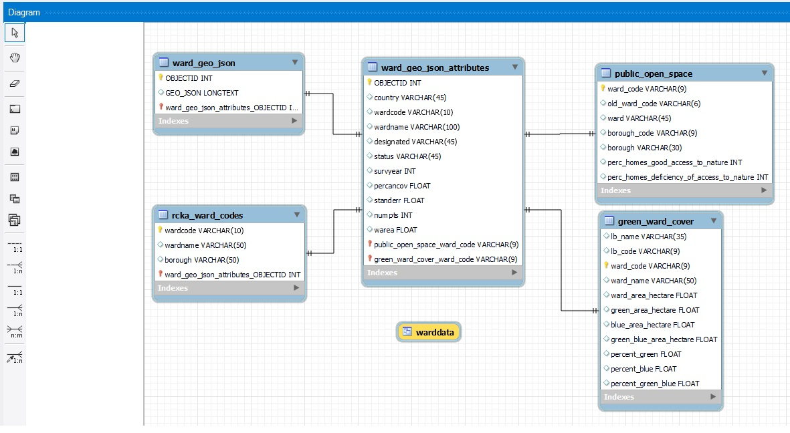

# Website-Architecture-0017_-CASA-CHEMS-

### Interactive Map Overview
Welcome to Our Environmental Awareness Website! When you visit our site, you'll be greeted by an intuitive and informative map that provides a comprehensive view of tree canopy coverage. This map, powered by Mapbox, offers dynamic layers and smooth navigation to explore both individual trees and broader areas. It's an engaging way to dive into our extensive data repository.

### Insight Page: Spreading Environmental Awareness
Our Insight Page is designed to educate visitors about the importance of tree canopies. It's structured to deliver information on various environmental benefits such as improved air quality, mental health, and biodiversity. The page includes sections like Tree Benefits, Why Tree Canopy Matters, a detailed Camden Borough case study, references, and a contact section. Styled with csstest.css, it presents information in an appealing and responsive design, making it an effective educational tool.

### Advanced Mapping and Data Visualization
In this recent development phase, we've integrated an advanced mapping system. Using page.html, map.js, and map.css, we've harnessed the power of Mapbox for dynamic map displays. This includes features like zoom controls, geojson sources, and interactive elements like click and hover events for in-depth data exploration. The integration of Echarts for bar charts and a VisualMap for color-coded information enriches the user experience, making our map a powerful tool for understanding and exploring tree canopy data.

### Database Development: Efficient and Accessible
Our backend development focused on aligning with system requirements and data availability. Opting for Ward-level GeoJSON, we used Python for data preparation and SQL for database structure. Our database includes GeoJSON records, attributes, and additional environmental data. The frontend interacts seamlessly with this database through SQL queries, managed by a NodeJS and Express backend. This setup guarantees efficient data handling and retrieval, supported by a configuration file that specifies SQL query structures. Our robust logging system ensures smooth and secure client-server interactions.

We're excited to share this platform with you and hope it inspires a deeper appreciation and understanding of our environment and the crucial role of tree canopies. Your journey towards environmental awareness starts here!

## Map page
The website map is displayed using Map page.html, map.js and map.css. 
### Top navigation bar
The top of the map page is a responsive navigation bar made with <ul>
```
  <ul class="topbar">
    <!-- Website name -->
    <li style="float:left"><a href="#Lnading" class="lia" style="font-size: 22px;"><strong>CHEMS-London Tree Canopy</strong></a></li>
    <!-- Page jump button drop-down -->
    <li style="float:right" class="dropdown">
      <a class="lia" href="javascript:void(0)" class="dropbtn"><i class="fa fa-bars"></i></a>
      <div class="dropdown-content">
        <a class="lia" href="index.html">Map</a>
        <a class="lia" href="insights.html">Insights</a>
      </div>
    </li>
    <!-- Page jump button -->
    <li class="Topbutton" style="float:right"><a href="insights.html"></a></li>
    <li class="Topbutton" style="float:right"><a href="index.html"></a></li>
  </ul>
```
### Map and data layer display
The website uses mapbox to output the map to the map div, and displays three layers in map.on('load', individual-tree layer, area-tree layer and area-tree-highlighted layer.
```
map.on('load', () => {
    //Add individual tree layer
    map.addSource("individual-tree", {
        type: "geojson",
        data: './mapjson/individual-tree.geojson',
    });
    map.addLayer({
        'id': "individual-tree-layer",
        'type': "fill",
        'source': "individual-tree",
        'paint': {
            "fill-color": "#32CD32",
            'fill-outline-color': "#006400",
        }//Display geographic labels on all layers
    }, 'housenum-label');
```
### click event
After the user clicks on the area-tree-layer area, the code in map.on('click') will identify the currently clicked area. Data information, read the information and output it to the html div "popup" for display. At the same time, the highlighted layer will draw the boundaries of the same polygon. Make it look prominent. and zoom to that area.
```
 map.on('click', 'area-tree-layer', (e) => {
        //Display area information after clicking
        var description = ("Area name: " + e.features[0].properties.wardname + '<br>' + "Coverage: " + e.features[0].properties.percancov + " %" + '<br>' + "survyear: " + e.features[0].properties.survyear + '<br>' + "warea: "+e.features[0].properties.warea+" m<sup>2</sup>");
        document.getElementById("popup").innerHTML = description;
    });
```
### Hovers event
map.on(mouse) is used to set the opacity of an area to 0 when the mouse is over it, and restore it when you leave it, so you can see the streets and individual trees layers at the bottom.
```
map.on('mousemove', 'area-tree-layer', (e) => {
        if (e.features.length > 0) {
            if (hoveredPolygonId !== null) {
                map.setFeatureState({
                    source: 'area-tree',
                    id: hoveredPolygonId
                }, {
                    hover: false
                });
            }
            hoveredPolygonId = e.features[0].id;
            map.setFeatureState({
                source: 'area-tree',
                id: hoveredPolygonId
            }, {
                hover: true
            });
        }
    });
```
### Bar chart
Create bar chart to visualize tree cover data. Here we use echarts to create a bar chart and output it to the barchart div of html. The data reads local geojson data through $.ajax, then pushes it into the y_data and x_data arrays, and then outputs these two arrays to xAxis and yAxis in displaychart.setOption.
```
var displaychart = echarts.init(document.getElementById("barchart"));
function displaylist(data) {
    displaychart.setOption({
        xAxis: {
            type: 'value',
        },
        yAxis: {
            type: 'category',
            data: y_data,
        },
        visualMap: {
            orient: 'horizontal',
            left: 'center',
            min: 0,
            max: 60,
            text: ['High', 'Low'],
            dimension: 0,
            inRange: {
                color: ['#edf8e9', '#005a32']
            }
        },
        series: [{
            name: 'conapy',
            type: 'bar',
            data: x_data,
            sort:'descending',
        }],
```
### 
After the bar chart bar is clicked, displaychart.on('click') reads the clicked data, uses querySourceFeatures to search for features in the area-tree-layer, and then uses the same fitBounds as on the mapbox. Zoom to the location of the anchor area. At the same time, the regional data information is read and output to the html div pop-up window. Additionally, a highlight layer is also used to highlight the relevant area when the mouse is hovered over the bar.
```
displaychart.on('click', function (params) {
    //Filter geojson data
    map.flyTo({
        center: [-0.1,51.5],
        zoom: 9,
        speed: 4, 
     });

     setTimeout(function() { zommtoarea(params); }, 1000);
})
//When the mouse is hovering over bar, highlighted area on map
displaychart.on('mouseover',function(params){
    map.setFilter('area-tree-layer-highlighted', ['in', 'wardname', params.name]);
})
```
## Insight Page
The Insights web page, designed to raise awareness about the importance of tree canopy coverage, features a detailed structure and design focusing on the environmental benefits of trees. Its primary sections include:

- Tree Benefits: Highlighting the numerous advantages trees offer, like air quality improvement and biodiversity enhancement. Interactive elements allow users to explore detailed information.
- Why it Matters: Discussing the critical role of tree canopy in urban areas, focusing on its multifaceted impacts.
- Case Study: Featuring a real-world example from Camden Borough, emphasizing the benefits of green spaces on mental health, supported by testimonials and links to external research.
- References: Providing credible sources for further exploration, with downloadable resources.
- contact: Enabling user engagement and feedback.

### 
Technically, insight page deployed: 

- Benefits Section: Lists tree benefits (like "Improved Air Quality") and provides a detailed explanation in a hidden div (<div id="introduction">), which becomes visible upon interaction.
- Interactive 'Read More' Button: JavaScript is used to toggle the visibility of the detailed benefits section. The readMoreButton.addEventListener script changes the text and display state of the detailed section upon clicking.
```
  <!-- readmore function   -->
        <button id="readMoreButton">Read More</button>
      
        <script>
          
          const introduction = document.getElementById('introduction');
          const readMoreButton = document.getElementById('readMoreButton');
      
          readMoreButton.addEventListener('click', function() {
            if (introduction.style.display === 'none') {
              introduction.style.display = 'block';
              readMoreButton.textContent = 'Read Less';
            } else {
              introduction.style.display = 'none';
              readMoreButton.textContent = 'Read More';
            }
          });
        </script>
```
  
- Images: Images are included to visually support the content which is done by excel. 
- Impact and Why It Matters Section: Further elaboration on the environmental, social, and economic benefits of trees, with another detailed section and an image.
- Case Study Section: Highlights a specific example in Camden, London, including challenges, descriptions, and goals, with links to external articles and an image.
```
 <!-- testimonials where reader can be direct to the webpage of the news -->
          <p><strong>Testimonials:</strong> <br><a href="https://www.forestryjournal.co.uk/news/23186215.direct-link-happiness-tree-cover-london/"> <br> Direct link between happiness and tree cover in London</a> <br>London's happiest borough is also one of its greenest,with new research suggesting there is a direct correlation between the two. <br> <br><a href="https://worldhappiness.report/ed/2020/how-environmental-quality-affects-our-happiness/">How Environmental Quality Affects Our Happiness</a> <br> Green spaces are beneficial for nearby residents. There is an established evidence base documenting the positive effects of green spaces on residents' health.</p>
```

- References Section: Offers downloadable resources and articles, enhancing the credibility and depth of information provided.
```
<section class="references">
      <h2>References</h2>
      <ul>
        <br>
        <li><a href="https://www.camden.gov.uk/documents/20142/5268201/Camden+Tree+Planting+Strategy.pdf" download>Camden Tree Planting Strategy</a></li>
        <br>
      
        <li><a href="Articles/HappinessGrowsOnTrees.pdf" download>Happiness grows on trees</a></li>
        <br>

        <li><a href="Articles/Trees Report Fina.pdf" download>Why we need more trees in the UK</a></li>
        <br>
      </ul>
    </section>
```

- Contact Section: In the footer, contact information is provided, enhancing user engagement and communication.

### CSS style 
The webpage's CSS style, external CSS files are linked for styling (stylestest.css), , ensures a clean, modern look with a dark green color scheme and responsive design, enhancing readability and user experience. The layout uses flex containers for balanced presentation, and images are designed to be responsive, maintaining aspect ratios.

## The Database

### Database Use

In the project the database had two main uses:
1. Process the large initial datasets to generate a GeoJSON file for a map layer
2. On request, supply data dynamically to the client via the webserver

### Data Sources and Required Transformation

An existing UK Ward-level GeoJSON flat file (~350MB) was utilised. This file was large, covering the wholes of the UK. For the website's purposes, London data was required. Using the Python scripts, the data was formatted to create files for import into the database and was cleansed removing characters that caused issues during the import. A future iteration of these scripts could be a temporary substitution of the offending characters with a query updating the text to revert to the original format.

#### Sources used:
 - https://data-forestry.opendata.arcgis.com/datasets/ecba26cfaf9d4b61bddc0e3284348d79_0/explore
 - https://smallsites.london/wards/
 - https://data.london.gov.uk/dataset/green-and-blue-cover
 - https://data.london.gov.uk/dataset/access-public-open-space-and-nature-ward

### Database and Flat File Structure

The GeoJSON data comprised unique OBJECTIDs, ward attributes, and extensive geometry data. Two MySQL tables ( `ward_geo_json` and `ward_geo_json_attributes`) were created. The former storing full records with the OBJECTID, while the latter holding data attributes, excluding geometries. this meant the data ws now queriable. OBJECTIDs serve as primary keys in both tables, balancing data accessibility with query performance.

A table (rcka_ward_codes) was created to hold London Wards. This could then be linked to the previous tables via the wardcode in ward_geo_json_attributes table and to the ward_geo_json through the OBJECTID. These relationships were used to establish the London subset. Python script were employed to extract this subset and generate the GeoJSON for the Mapbox tree canopy layer. This reduced the file size from its origial ~350MB to around 7.5MB.

Additional tables to supplement the map data were added, `public_open_space` and `green_ward_cover`. These are efficiently queried using ward codes as primary keys and indexing search columns. Where ward codes differed, no updates to the original codes were made to maintain data integrity.




To produce real-time query results for the frontend, a view was created using `ward_geo_json_attributes` as the central table. This is the same data used to produce the map layer meaniing the ward codes will have a match. Supplemental data is pulled from the `public_open_space` and `green_ward_cover` tables through left joins. If no match is found, nulls are returned for those fields for the Javascript code to handle.

A database view object was created to abstract away from the underlying tables and present a single object that would then be the only object the NodeJS code was granted access to. Permissioning restrictions on the database meant that the view could not be created on the UCL server but this was fully tested and in operation ahead of migration to the CASA server. Data formatting is executed within the database to reduce frontend processing.

### Security Measures

The web client is granted read-only access, with credentials securely stored outside of GitHub (gitignored). There are SQL injection risks due to input validation being delegated to the web server, a trade-off accepted to retain dynamic query capabilities.


## Backend Server

This site's architecture comprises three key components: the frontend, backend server, and backend database. This section covers the backend server, which is distinct from the client frontend browser and runs on a designated infrastructure.

### Technology Stack

The backend server is built using NodeJS. It is responsible for handling requests from the frontend, including serving the default page. The NodeJS app facilitates asynchronous, event-driven interactions, significantly enhancing resource management by freeing up the server post-request processing.

INSERT PPT IMG

#### Express Framework

NodeJS employs the Express library, a web application framework crucial for managing client-server interactions. Express provides straightforward methods for handling low-level communications and request management. 

#### Server Configuration

An 'app' constant is defined the Node code. It is an instance of the 'express' object. This app is bound to a designated port (set in the config file) and listens for client requests.  It manages server application routes, enabling client interactions and configuring specific directories for content serving.

### Primary Routes

Two primary routes are handled:

1. Root route (`/`): Serves the default webpage.
2. `/getWardData`: Manages requests for supplemental ward information from the MySQL database. This includes validation against SQL injection, with a 400 Bad Request response for validation failures.

#### Security Measures

- **Express-rate-limit**: To enhance security and robustness, implement the 'express-rate-limit' library, limiting requests from single IP addresses. This helps mitigate Denial-of-Service attacks. An express-rate-limiter was included and operational ahead of deployment on the CASA server. This library errors on the UCL server so this functionality has been commented out for this implementation but was fully tested ahead of migration.
- **MySQL Integration**: Data retrieval is managed via the 'mysql' library. Instead of a single connection, a scalable connection pool is established, handling high request volumes efficiently. Again, the CASA server implementation errors on use of this library so this have been pointed to the single conection for this implementation. The pool connection was tested and operational externally. 

### Data Retrieval and Error Handling

Upon Ward data requests, the MySQL connection (pool) sends select statements to the database, returning results in a JSON object. Server errors (500) are communicated in case of database issues.

#### Dynamic SQL Construction

- A config file specifies database columns for result sets, allowing dynamic SQL construction. The frontend JavaScript code adapts to changes in the supplemental data returned from the database via asynchronous 'await' functionality.
- Unknown route requests default to a “Cannot GET” response.

#### Logging and Maintenance

Error handling is a critical component of the NodeJS code. Logging on the node server records errors and client interactions, categorized into two separate timestamped log files. This aids in error identification and event sequence analysis. Log files are created daily to streamline file management.


